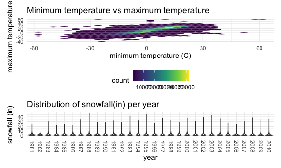

Homework 3
================
Michelle Lui

### Problem 1

``` r
data("instacart")
```

This dataset contains 1384617 rows and … columns.

Observations are the level of items in orders by user. There are
user/order variables – user ID, order ID, order day, and order hour.
There are also item variables – name, aisle, department, and some
numeric codes.

How many aisles, and which are most items from?

``` r
instacart %>%
  count(aisle) %>%
  arrange(desc(n))
```

    ## # A tibble: 134 x 2
    ##    aisle                              n
    ##    <chr>                          <int>
    ##  1 fresh vegetables              150609
    ##  2 fresh fruits                  150473
    ##  3 packaged vegetables fruits     78493
    ##  4 yogurt                         55240
    ##  5 packaged cheese                41699
    ##  6 water seltzer sparkling water  36617
    ##  7 milk                           32644
    ##  8 chips pretzels                 31269
    ##  9 soy lactosefree                26240
    ## 10 bread                          23635
    ## # … with 124 more rows

Let’s make a plot

``` r
instacart %>%
  count(aisle) %>%
  filter(n>10000) %>%
  mutate(
    aisle = factor(aisle),
    aisle = fct_reorder(aisle, n)
  ) %>%
  ggplot(aes(x = aisle, y = n)) +
  geom_point() +
  theme(axis.text.x = element_text(angle = 90, vjust = 0.5, hjust = 1))
```


Let’s make a table\!

``` r
instacart %>%
  filter(aisle %in% c("baking ingredients", "dog food care", "packaged vegetables fruits")) %>%
  group_by(aisle) %>%
  count(product_name) %>%
  mutate(rank = min_rank(desc(n))) %>%
  filter(rank < 4) %>%
  arrange(aisle, rank) %>%
  knitr::kable()
```

| aisle                      | product\_name                                 |    n | rank |
| :------------------------- | :-------------------------------------------- | ---: | ---: |
| baking ingredients         | Light Brown Sugar                             |  499 |    1 |
| baking ingredients         | Pure Baking Soda                              |  387 |    2 |
| baking ingredients         | Cane Sugar                                    |  336 |    3 |
| dog food care              | Snack Sticks Chicken & Rice Recipe Dog Treats |   30 |    1 |
| dog food care              | Organix Chicken & Brown Rice Recipe           |   28 |    2 |
| dog food care              | Small Dog Biscuits                            |   26 |    3 |
| packaged vegetables fruits | Organic Baby Spinach                          | 9784 |    1 |
| packaged vegetables fruits | Organic Raspberries                           | 5546 |    2 |
| packaged vegetables fruits | Organic Blueberries                           | 4966 |    3 |

Apples vs ice cream..

``` r
instacart %>%
  filter(product_name %in% c("Pink Lady Apples", "Coffee Ice Cream")) %>%
  group_by(product_name, order_dow) %>%
  summarize(mean_hour = mean(order_hour_of_day)) %>%
  pivot_wider(
    names_from = order_dow,
    values_from = mean_hour
  )
```

    ## `summarise()` regrouping output by 'product_name' (override with `.groups` argument)

    ## # A tibble: 2 x 8
    ## # Groups:   product_name [2]
    ##   product_name       `0`   `1`   `2`   `3`   `4`   `5`   `6`
    ##   <chr>            <dbl> <dbl> <dbl> <dbl> <dbl> <dbl> <dbl>
    ## 1 Coffee Ice Cream  13.8  14.3  15.4  15.3  15.2  12.3  13.8
    ## 2 Pink Lady Apples  13.4  11.4  11.7  14.2  11.6  12.8  11.9

\#\#\#Problem 2

Import, read, and tidy the dataset.

``` r
accel_df = 
  read_csv("./data/accel_data.csv") %>%
  janitor::clean_names() %>%
  pivot_longer(
    activity_1:activity_1440,
    names_to = "min_of_day",
    names_prefix = "activity_",
    values_to = "activity_count") %>%
  mutate(
    day_type = 
      case_when(
        day %in% c("Monday", "Tuesday", "Wednesday", "Thursday", "Friday") ~ "weekday",
        day %in% c("Saturday", "Sunday") ~ "weekend")) %>%
  mutate(
    day = as.factor(day),
    day_type = as.factor(day_type),
    min_of_day = as.numeric(min_of_day)) %>%
  mutate(
    day = factor(day, levels = c("Monday", "Tuesday", "Wednesday", "Thursday", "Friday", "Saturday", "Sunday"))) %>%
  arrange(day)
```

    ## Parsed with column specification:
    ## cols(
    ##   .default = col_double(),
    ##   day = col_character()
    ## )

    ## See spec(...) for full column specifications.

In this dataset, there are 6 variables, consisting of week, day\_id,
day, min\_of\_day, activity\_count, day\_type. There are 50400
observations in this dataset.

Aggregate across minutes to create a total activity for each day. Create
table that shows this.

``` r
accel_df %>%
  group_by(week,day) %>%
  summarize(activity_count = sum(activity_count)) %>%
  knitr::kable()
```

    ## `summarise()` regrouping output by 'week' (override with `.groups` argument)

| week | day       | activity\_count |
| ---: | :-------- | --------------: |
|    1 | Monday    |        78828.07 |
|    1 | Tuesday   |       307094.24 |
|    1 | Wednesday |       340115.01 |
|    1 | Thursday  |       355923.64 |
|    1 | Friday    |       480542.62 |
|    1 | Saturday  |       376254.00 |
|    1 | Sunday    |       631105.00 |
|    2 | Monday    |       295431.00 |
|    2 | Tuesday   |       423245.00 |
|    2 | Wednesday |       440962.00 |
|    2 | Thursday  |       474048.00 |
|    2 | Friday    |       568839.00 |
|    2 | Saturday  |       607175.00 |
|    2 | Sunday    |       422018.00 |
|    3 | Monday    |       685910.00 |
|    3 | Tuesday   |       381507.00 |
|    3 | Wednesday |       468869.00 |
|    3 | Thursday  |       371230.00 |
|    3 | Friday    |       467420.00 |
|    3 | Saturday  |       382928.00 |
|    3 | Sunday    |       467052.00 |
|    4 | Monday    |       409450.00 |
|    4 | Tuesday   |       319568.00 |
|    4 | Wednesday |       434460.00 |
|    4 | Thursday  |       340291.00 |
|    4 | Friday    |       154049.00 |
|    4 | Saturday  |         1440.00 |
|    4 | Sunday    |       260617.00 |
|    5 | Monday    |       389080.00 |
|    5 | Tuesday   |       367824.00 |
|    5 | Wednesday |       445366.00 |
|    5 | Thursday  |       549658.00 |
|    5 | Friday    |       620860.00 |
|    5 | Saturday  |         1440.00 |
|    5 | Sunday    |       138421.00 |

For the last few weeks in the datset, it appears that there is very low
activity on Saturdays compared to the rest of the days. Activity also
seems to increase generally from Mondays through Fridays. The days with
the highest values tend to be Fridays and Sundays.

Make plot that shows 24-hour activity time courses for each day and use
color to indicate day of the week.

``` r
accel_df %>%
  select(day_id, day, min_of_day, activity_count) %>%
  group_by(day,min_of_day) %>%
  summarize(day_id = day_id, mean_activity_count = mean(activity_count, na.rm = TRUE)) %>%
  ggplot(aes(x = min_of_day, y = mean_activity_count, group = day_id, color = day)) +
    geom_point() +
    geom_path()+
    labs(title = "Average activity count per minute for 35 days", x = "Minute of the day", y = "Average activity count") 
```

    ## `summarise()` regrouping output by 'day', 'min_of_day' (override with `.groups` argument)


For this graph, I took the average of each activity county for each
minute of each weekday (Monday, Tuesday, etc.), and plotted that against
minutes of the day, and connected the lines based off of each of the 35
days in order to make it easier to interpret.

Based off of this graph I can see that Sundays and Fridays have the
highest activity of the week, with Sundays having higher activity in the
middle of the day, and Fridays having higher activity in the evening.
There is low activity in the first third of the day, with activity also
decreasing at the end of the day. Mondays through Thursdays and
Saturdays all seem to have relatively lower activity compared to Fridays
and Saturdays.

\#\#\#Problem 3

Import and clean data. Convert precipitation, snow depth, and snowfall
to inches, and tmax and tmin to degrees C.

``` r
library(p8105.datasets)
data("ny_noaa")
summary(ny_noaa)
```

    ##       id                 date                 prcp               snow       
    ##  Length:2595176     Min.   :1981-01-01   Min.   :    0.00   Min.   :  -13   
    ##  Class :character   1st Qu.:1988-11-29   1st Qu.:    0.00   1st Qu.:    0   
    ##  Mode  :character   Median :1997-01-21   Median :    0.00   Median :    0   
    ##                     Mean   :1997-01-01   Mean   :   29.82   Mean   :    5   
    ##                     3rd Qu.:2005-09-01   3rd Qu.:   23.00   3rd Qu.:    0   
    ##                     Max.   :2010-12-31   Max.   :22860.00   Max.   :10160   
    ##                                          NA's   :145838     NA's   :381221  
    ##       snwd            tmax               tmin          
    ##  Min.   :   0.0   Length:2595176     Length:2595176    
    ##  1st Qu.:   0.0   Class :character   Class :character  
    ##  Median :   0.0   Mode  :character   Mode  :character  
    ##  Mean   :  37.3                                        
    ##  3rd Qu.:   0.0                                        
    ##  Max.   :9195.0                                        
    ##  NA's   :591786

In this dataset there are 2595176 observations, and 7 variables, which
consist of id, date, prcp, snow, snwd, tmax, tmin. There is quite of bit
of missing data, with prcp missing 145838 observations, snow missing
381221, and snwd missing 591786. Id, tmax, tmin are in the character
format, date is in the date format, and prcp, snow, and snwd are in the
integer format.

``` r
ny_noaa_df = 
  ny_noaa %>%
    separate(date, sep="-", into = c("year", "month", "day")) %>%
    mutate(
      tmax = as.numeric(tmax),
      tmin = as.numeric(tmin),
      tmax = tmax / 10,
      tmin = tmin / 10,
      prcp = prcp * .003937,
      snow = snow * .03937,
      snwd = snwd * .03937) 
 
sort_df = 
  ny_noaa_df %>%
  count(snow, sort = TRUE)
```

For this dataset, I divided the tmin and tmax by 10, so that temperature
would be reported as degrees Celsius rather than tenths of a degree
Celsius. I also multiplied snow and snwd by .03937, because this is the
conversion factor from mm to inches, and I believe rain and snow are
usually reported in inches. I multiplied prcp by .003937 because it was
originally reported as tenths of a mm, and I wanted to report it as
inches.

For snowfall, the most commonly observed values are NA and 0.00; this is
because for most days of the year it is not snowing in New York State,
so the amount of snowfall in inches would be 0, or it wouldn’t be given
at all (NA).

Make a two-panel plot showing the average max temperature in January and
in July for each station across the years.

``` r
plot1_df = 
ny_noaa_df %>%
  group_by(id, year, month) %>%
  summarize(mean_tmax = mean(tmax, na.rm = TRUE)) %>%
  subset(month %in% c("01", "07")) %>%
  drop_na(mean_tmax) %>%
  mutate(
    year = as.numeric(year)
  )
```

    ## `summarise()` regrouping output by 'id', 'year' (override with `.groups` argument)

``` r
ggplot(plot1_df, aes(x = year, y = mean_tmax, group = id, color = id)) +
  geom_point() +
  geom_path() +
  facet_grid(~ month) + 
  labs(title = "Average maximum temperature for Janurary and July per year", x = "year", y = "Average max temperature (C)") +
  theme(legend.position = "none", axis.text.x = element_text(angle = 90, vjust = 0.5, hjust = 1)) +
  scale_x_continuous(breaks = plot1_df$year)
```


In this 2 panel plot, it is evident that the max temperatures in July
(range \~ 20 to 33 degrees C) are much higher than that of January
(range \~ -10 to 10 degrees C). There are no particular trends visible
within the plots for each month besides that there seems to be peaks and
dips between the years quite frequently. Some outliers that are visible
January are: one station in 1982 had a very low temperature \~ -14
degrees C, and one in 2005 had a temperature of \~ -12 degrees C. For
July, some obvious outliers were one station in 1988 had a lower
temperature of \~14 degrees C, and the different stations in the years
1984, 2004, and 2007 all experienced a slightly lower temperature of
around \~19 degrees C.

Make a two panel plot showing tmax vs tmin for the full dataset.

``` r
plot2_df = 
  ny_noaa_df %>%
  drop_na(tmax, tmin)

plot2 = 
ggplot(plot2_df, aes(x = tmin, y = tmax)) +
      labs(title = "Minimum temperature vs maximum temperature", x = "minimum temperature (C)", y = "maximum temperature (C)") +
         geom_hex()
```

Make a plot showing the distribution of snowfall values greater than 0
and less than 100 separately by year.

``` r
plot3_df = 
  ny_noaa_df %>%
  subset(0 < snow & snow < 100)

plot3 = 
ggplot(plot3_df, aes(x = year, y = snow)) +
  geom_violin() +
  labs(title = "Distribution of snowfall(in) per year", x = "year", y = "snowfall (in)") +
  theme(axis.text.x = element_text(angle = 270, vjust = 0.5, hjust = 1))
```

Patch them together\!

``` r
library(patchwork)
plot2 / plot3
```


