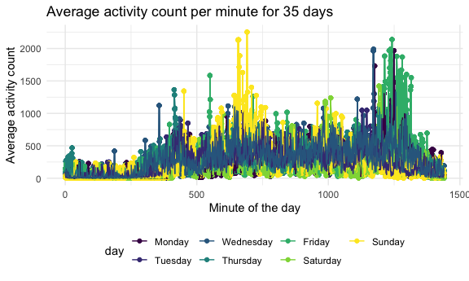

Homework 3
================
Michelle Lui

### Problem 1

``` r
data("instacart")
```

This dataset contains 1384617 rows and … columns.

Observations are the level of items in orders by user. There are
user/order variables – user ID, order ID, order day, and order hour.
There are also item variables – name, aisle, department, and some
numeric codes.

How many aisles, and which are most items from?

``` r
instacart %>%
  count(aisle) %>%
  arrange(desc(n))
```

    ## # A tibble: 134 x 2
    ##    aisle                              n
    ##    <chr>                          <int>
    ##  1 fresh vegetables              150609
    ##  2 fresh fruits                  150473
    ##  3 packaged vegetables fruits     78493
    ##  4 yogurt                         55240
    ##  5 packaged cheese                41699
    ##  6 water seltzer sparkling water  36617
    ##  7 milk                           32644
    ##  8 chips pretzels                 31269
    ##  9 soy lactosefree                26240
    ## 10 bread                          23635
    ## # … with 124 more rows

Let’s make a plot

``` r
instacart %>%
  count(aisle) %>%
  filter(n>10000) %>%
  mutate(
    aisle = factor(aisle),
    aisle = fct_reorder(aisle, n)
  ) %>%
  ggplot(aes(x = aisle, y = n)) +
  geom_point() +
  theme(axis.text.x = element_text(angle = 90, vjust = 0.5, hjust = 1))
```


Let’s make a table\!

``` r
instacart %>%
  filter(aisle %in% c("baking ingredients", "dog food care", "packaged vegetables fruits")) %>%
  group_by(aisle) %>%
  count(product_name) %>%
  mutate(rank = min_rank(desc(n))) %>%
  filter(rank < 4) %>%
  arrange(aisle, rank) %>%
  knitr::kable()
```

| aisle                      | product\_name                                 |    n | rank |
| :------------------------- | :-------------------------------------------- | ---: | ---: |
| baking ingredients         | Light Brown Sugar                             |  499 |    1 |
| baking ingredients         | Pure Baking Soda                              |  387 |    2 |
| baking ingredients         | Cane Sugar                                    |  336 |    3 |
| dog food care              | Snack Sticks Chicken & Rice Recipe Dog Treats |   30 |    1 |
| dog food care              | Organix Chicken & Brown Rice Recipe           |   28 |    2 |
| dog food care              | Small Dog Biscuits                            |   26 |    3 |
| packaged vegetables fruits | Organic Baby Spinach                          | 9784 |    1 |
| packaged vegetables fruits | Organic Raspberries                           | 5546 |    2 |
| packaged vegetables fruits | Organic Blueberries                           | 4966 |    3 |

Apples vs ice cream..

``` r
instacart %>%
  filter(product_name %in% c("Pink Lady Apples", "Coffee Ice Cream")) %>%
  group_by(product_name, order_dow) %>%
  summarize(mean_hour = mean(order_hour_of_day)) %>%
  pivot_wider(
    names_from = order_dow,
    values_from = mean_hour
  )
```

    ## `summarise()` regrouping output by 'product_name' (override with `.groups` argument)

    ## # A tibble: 2 x 8
    ## # Groups:   product_name [2]
    ##   product_name       `0`   `1`   `2`   `3`   `4`   `5`   `6`
    ##   <chr>            <dbl> <dbl> <dbl> <dbl> <dbl> <dbl> <dbl>
    ## 1 Coffee Ice Cream  13.8  14.3  15.4  15.3  15.2  12.3  13.8
    ## 2 Pink Lady Apples  13.4  11.4  11.7  14.2  11.6  12.8  11.9

\#\#\#Problem 2

Import, read, and tidy the dataset.

``` r
accel_df = 
  read_csv("./data/accel_data.csv") %>%
  janitor::clean_names() %>%
  pivot_longer(
    activity_1:activity_1440,
    names_to = "min_of_day",
    names_prefix = "activity_",
    values_to = "activity_count") %>%
  mutate(
    day_type = 
      case_when(
        day %in% c("Monday", "Tuesday", "Wednesday", "Thursday", "Friday") ~ "weekday",
        day %in% c("Saturday", "Sunday") ~ "weekend")) %>%
  mutate(
    day = as.factor(day),
    day_type = as.factor(day_type),
    min_of_day = as.numeric(min_of_day)) %>%
  mutate(
    day = factor(day, levels = c("Monday", "Tuesday", "Wednesday", "Thursday", "Friday", "Saturday", "Sunday")))
```

    ## Parsed with column specification:
    ## cols(
    ##   .default = col_double(),
    ##   day = col_character()
    ## )

    ## See spec(...) for full column specifications.

Aggregate across minutes to create a total activity for each day. Create
table that shows this.

``` r
table1 = 
accel_df %>%
  group_by(week,day) %>%
  summarize(activity_count = sum(activity_count)) %>%
  knitr::kable()
```

    ## `summarise()` regrouping output by 'week' (override with `.groups` argument)

Make plot that shows 24-hour activity time courses for each day and use
color to indicate day of the week.

``` r
ggplot(accel_df, aes(x = min_of_day, y = activity_count, color = day)) +
  stat_smooth()+
  geom_point() +
  geom_line()
```

    ## `geom_smooth()` using method = 'gam' and formula 'y ~ s(x, bs = "cs")'



\#\#\#Problem 3

Import and clean data. Convert precipitation, snow depth, and snowfall
to inches, and tmax and tmin to degrees C.

``` r
library(p8105.datasets)
data("ny_noaa")

ny_noaa_df = 
  ny_noaa %>%
    separate(date, sep="-", into = c("year", "month", "day")) %>%
    mutate(
      tmax = as.numeric(tmax),
      tmin = as.numeric(tmin),
      tmax = tmax / 10,
      tmin = tmin / 10,
      prcp = prcp * .003937,
      snow = snow * .03937,
      snwd = snwd * .03937
    )
```

Make a two-panel plot showing the average max temperature in January and
in July for each station across the years.

``` r
plot1_df = 
ny_noaa_df %>%
  group_by(id, year, month) %>%
  summarize(mean_tmax = mean(tmax, na.rm = TRUE)) %>%
  subset(month %in% c("01", "07")) %>%
  drop_na(mean_tmax) %>%
  mutate(
    year = as.numeric(year)
  )
```

    ## `summarise()` regrouping output by 'id', 'year' (override with `.groups` argument)

``` r
ggplot(plot1_df, aes(x = year, y = mean_tmax, group = id, color = id)) +
  geom_point() +
  geom_path() +
  facet_grid(~ month) + 
  labs(title = "Average maximum temperature for Janurary and July per year", x = "year", y = "Average max temperature (C)") +
  theme(legend.position = "none", axis.text.x = element_text(angle = 90, vjust = 0.5, hjust = 1)) +
  scale_x_continuous(breaks = plot1_df$year)
```


Make a two panel plot showing tmax vs tmin for the full dataset.

``` r
plot2_df = 
  ny_noaa_df %>%
  drop_na(tmax, tmin)

ggplot(plot2_df, aes(x = tmin, y = tmax)) +
         geom_hex()
```


Make a plot showing the distribution of snowfall values greater than 0
and less than 100 separately by year.

``` r
plot3_df = 
  ny_noaa_df %>%
  subset(0 < snow & snow < 100)

ggplot(plot3_df, aes(x = year, y = snow)) +
  geom_point() +
  labs(title = "Distribution of snowfall(in) per year", x = "year", y = "snowfall (in)") +
  theme(axis.text.x = element_text(angle = 270, vjust = 0.5, hjust = 1))
```


